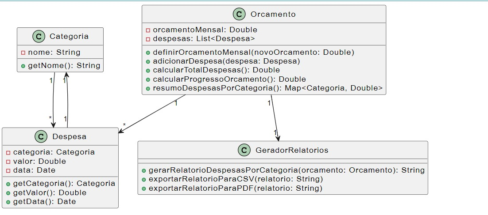

# Introdução

O presente projeto tem como objetivo desenvolver um aplicativo de gerenciamento de despesas que auxilie os usuários a ter um melhor controle sobre suas finanças pessoais, possibilitando a tomada de decisões financeiras mais conscientes e eficazes. A proposta é oferecer uma ferramenta simples e intuitiva que permita registrar e categorizar as despesas diárias, além de fornecer relatórios detalhados para acompanhar o fluxo de caixa e identificar áreas de economia.



O aplicativo fornece as ferramentas necessárias para registrar, categorizar e analisar os gastos, o que permite aos usuários tomar decisões mais conscientes sobre como administrar seu dinheiro.

## Para executar o projeto:
### Instale o ambiente virtual:
```bash
python -m venv venv
```
### Ative o ambiente virtual:
```bash
  venv/Scripts/activate
```
### Dentro da pasta do projeto,instale as dependências:

```bash
 pip install -r requirements.txt
```
## Funcionalidades do Aplicativo

1. **Registro de Despesas:** Permite adicionar novas despesas, incluindo a categoria, o valor e a data da despesa. Essa funcionalidade é essencial para ter um registro completo dos gastos e poder acompanhá-los ao longo do tempo.

2. **Categorização de Despesas:** Permite categorizar as despesas em categorias pré-definidas, como alimentação, transporte e moradia. Essa funcionalidade facilita a análise dos gastos e a identificação de áreas em que se pode economizar.

3. **Resumo de Despesas:** Permite visualizar um resumo das despesas por categoria, data – ou período - e valor. Essa funcionalidade oferece uma visão geral dos gastos e ajuda a identificar padrões de consumo.

4. **Orçamento Mensal:** A funcionalidade permite definir um orçamento por período e acompanhar o progresso de gastos em relação ao orçamento definido. Importante no controle de gastos e evitar endividamento.

5. **Exportação de Dados:** Com esta funcionalidade é possível exportar os dados de despesas para um arquivo CSV ou PDF. Dessa forma, os dados podem ser usados em outros programas, como planilhas eletrônicas, para análises mais complexas.

# Testes Unitários

O objetivo dos testes unitários é testar unidades individuais de código, como funções, métodos ou classes, para garantir que cada unidade de código funcione como esperado, independentemente de outras partes do sistema. Esse processo deve ser feito de forma automatizada e será executado frequentemente como parte do processo de desenvolvimento para facilitar a detecção precoce de erros e isolamento de problemas. Essas ações endossam maior confiabilidade do código.

A automatização de testes é proporcionada por ferramentas ou frameworks que possibilitam a execução dos testes de forma automatizada. Essas ferramentas possibilitam que o desenvolvedor crie casos de testes com a finalidade de validar os códigos desenvolvidos.

O framework utilizado foi o `unittest`, integrado à biblioteca padrão do Python. A escolha do `unittest` se justifica por diversos motivos como curva de aprendizado rápida, facilitando o aprendizado e a escrita de testes, recursos nativos e além disso, o `unittest` possui extensa documentação oficial que fornece suporte e exemplos de uso.

Para o sistema de gerenciamento de despesas foi inicialmente elaborada uma estrutura de classes mais complexa para o sistema de controle de gastos. Mas a escolha por simplificar a estrutura do projeto foi tomada para otimizar o tempo de desenvolvimento e garantir a entrega de um sistema funcional dentro do prazo estabelecido. A estrutura atual, embora mais simples, ainda atende aos requisitos básicos do sistema de controle de gastos.

Para determinar se o sistema é adequado para uso, os testes estão organizados em três classes:

1. `TestCategoria`
2. `TestDespesa`
3. `TestOrcamento`

Sendo que cada classe de teste contém uma série de métodos que testam diferentes aspectos da funcionalidade da classe como detalhado a seguir.

### Classe TestCategoria

- **Obter nome da categoria:** Verifica se o método `getNome()` retorna o nome correto da categoria após sua criação.
  
- **Criar categoria:**
  - Verifica se a criação de uma categoria com nome vazio gera uma exceção `ValueError`.
  - Verifica se a criação de uma categoria com nome composto apenas por números gera uma exceção `ValueError`.
  
- **Editar categoria:**
  - Verifica se a edição do nome da categoria para um valor vazio gera uma exceção `ValueError`.
  - Verifica se a edição do nome da categoria para um novo valor é bem-sucedida e se o novo nome é retornado corretamente.
  - Verifica se o nome original da categoria é preservado após a tentativa de edição inválida.

### Classe TestDespesa

- **Obter valor da despesa:** Verifica se o método `obter_valor_despesa` altera o valor da despesa para um novo valor especificado.
  
- **Buscar categoria:** Verifica se o método `getCategoria` retorna a categoria correta da despesa.
  
- **Obter nome da despesa:** Verifica se o método `getNomeDespesa` retorna o nome correto da despesa.

**Validar nome da despesa**

- Verifica se a criação de uma despesa com nome vazio gera uma exceção `ValueError`.
- Verifica se a definição de um valor negativo para a despesa gera uma exceção `ValueError`.

### Classe TestOrcamento

- **Definir orçamento:**
  - Verifica se a definição do orçamento com um valor não numérico gera uma exceção `ValueError`.
  - Verifica se a definição do orçamento com uma string vazia gera uma exceção `ValueError`.
  - Verifica se a definição do orçamento com um valor negativo gera uma exceção `ValueError`.
  - Verifica se a definição do orçamento com um valor zero gera uma exceção `ValueError`.
  - Verifica se a definição do orçamento com um valor válido é bem-sucedida e se o valor é armazenado corretamente.
- **Adicionar despesa:**
  - Verifica se uma despesa é adicionada à lista de despesas do orçamento.
  - Verifica se várias despesas podem ser adicionadas à lista de despesas do orçamento.
  - Verifica se a adição de uma despesa que excede o orçamento gera uma exceção `ValueError`.
- **Calcular total de despesas:**
  - Verifica se o total de despesas é calculado corretamente.
  - Verifica se o total de despesas é zero quando não há despesas.
  - Verifica se o total de despesas é atualizado após a remoção de uma despesa.
- **Calcular progresso do orçamento:**
  - Verifica se o progresso do orçamento é zero quando não há despesas.
  - Verifica se o progresso do orçamento é calculado corretamente.
- **Resumo de despesas por categoria:**
  - Verifica se o resumo de despesas por categoria é um dicionário vazio quando não há despesas.
  - Verifica se o resumo de despesas por categoria é gerado corretamente, agrupando as despesas por categoria e somando seus valores.
  - Verifica se a exceção `ValueError` é lançada se o orçamento for excedido.

## Descrição Detalhada dos Testes

### Classe TestCategoria

- **test_criar_categoria:**
  - Verifica se a criação de uma categoria com nome vazio gera uma exceção `ValueError`.
    - **Entrada:** String vazia
    - **Saída esperada:** Exceção `ValueError`
    - **Objetivo:** Garantir que categorias não sejam criadas sem nome.

```python
 def test_criar_categoria(self):
        with self.assertRaises(ValueError):
            categoria = Categoria("")
            
```

- **test_criar_categoria_numero:**
  - Verifica se a criação de uma categoria com nome composto apenas por números gera uma exceção `ValueError`.
    - **Entrada:** String composta apenas por números
    - **Saída esperada:** Exceção `ValueError`
    - **Objetivo:** Garantir que nomes de categorias sejam descritivos e não apenas números.

    ```python
     def test_criar_categoria_numero(self):
        with self.assertRaises(ValueError):
            categoria = Categoria("123")
    ```

- **test_editar_categoria:**
  - **Parte 1:** Verifica se a edição do nome da categoria para um valor vazio gera uma exceção `ValueError`.
    - **Entrada:** String vazia
    - **Saída esperada:** Exceção `ValueError`
    - **Objetivo:** Manter a consistência dos nomes das categorias.
  - **Parte 2:** Verifica se a edição do nome da categoria para um novo valor é bem-sucedida e se o novo nome é retornado corretamente.
    - **Entrada:** Novo nome da categoria
    - **Saída esperada:** Novo nome retornado pelo método `get_nome`
    - **Objetivo:** Garantir a atualização correta do nome da categoria.

    ```python
     def test_editar_categoria(self):
        categoria = Categoria("Categoria Teste")

        with self.assertRaises(ValueError):
            categoria.setNome("")

        categoria.setNome("Nova Categoria")
        self.assertEqual(categoria.getNome(), "Nova Categoria")
    ```

- **test_editar_categoria_numero:**
  - **Parte 1:** Verifica se a edição do nome da categoria para um valor composto apenas por números gera uma exceção `ValueError`.
    - **Entrada:** String composta apenas por números
    - **Saída esperada:** Exceção `ValueError`
    - **Objetivo:** Manter a consistência dos nomes das categorias.
  - **Parte 2:** Verifica se o nome original da categoria é preservado após a tentativa de edição inválida.
    - **Entrada:** String composta apenas por números
    - **Saída esperada:** Nome original retornado pelo método `get_nome`
    - **Objetivo:** Garantir que a falha na edição não corrompa o nome original.

```python
 def test_editar_categoria_numero(self):
        categoria = Categoria("Categoria Teste")

        with self.assertRaises(ValueError):
            categoria.setNome("123")

        self.assertEqual(categoria.getNome(), "Categoria Teste")

```

- **test_obter_categoria:**
  - Verifica se o método `getNome` retorna o nome correto da categoria após sua criação.
    - **Entrada:** Nenhuma
    - **Saída esperada:** Nome da categoria definido no construtor
    - **Objetivo:** Validar o acesso ao nome da categoria.

```python
def test_obter_categoria(self):
        categoria = Categoria("Categoria Teste")
        nome_categoria = categoria.getNome()
        self.assertEqual(nome_categoria, "Categoria Teste")
```

##### Classe TestDespesa

- **test_obter_valor_despesa:**
  - **Parte 1:** Verifica se o método `obter_valor_despesa` altera o valor da despesa para um novo valor especificado.
    - **Entrada:** Novo valor da despesa
    - **Saída esperada:** Novo valor retornado pelo método `getValor`
    - **Objetivo:** Garantir a atualização correta do valor da despesa.
  - **Parte 2:** Verifica se o novo valor é retornado corretamente pelo método `getValor`.
    - **Entrada:** Nenhuma
    - **Saída esperada:** Novo valor da despesa definido na parte 1
    - **Objetivo:** Validar o acesso ao valor da despesa após sua atualização.

    ```python
    def test_obter_valor_despesa(self):
        novo_valor = 50
        self.despesa.obter_valor_despesa(novo_valor)
        self.assertEqual(self.despesa.getValor(), novo_valor)
    ```

- **test_getCategoria:** Verifica se o método `getCategoria` retorna a categoria correta da despesa.
  - **Entrada:** Nenhuma
  - **Saída esperada:** Categoria da despesa definida no construtor
  - **Objetivo:** Validar o acesso à categoria da despesa.

  ```python
  def test_getCategoria(self):
        self.assertEqual(self.despesa.getCategoria(), self.categoria)

  ```

- **test_getNomeDespesa:** Verifica se o método `getNomeDespesa` retorna o nome correto da despesa.
  - **Entrada:** Nenhuma
  - **Saída esperada:** Nome da despesa definido no construtor
  - **Objetivo:** Validar o acesso ao nome da despesa.

```python
 def test_getNomeDespesa(self):
        self.assertEqual(self.despesa.getNomeDespesa(), "Almoço")
```

- **test_nome_despesa_vazio:** Verifica se a criação de uma despesa com nome vazio gera uma exceção `ValueError`.
  - **Entrada:** String vazia
  - **Saída esperada:** Exceção `ValueError`
  - **Objetivo:** Garantir que despesas sejam criadas com nomes descritivos.

  ```python
  def test_nome_despesa_vazio(self):
        with self.assertRaises(ValueError):
            despesa_vazia = Despesa(self.categoria, 50.0, date.today(), "")
  ```

- **test_valor_despesa_negativo:** Verifica se a definição de um valor negativo para a despesa gera uma exceção `ValueError`.
  - **Entrada:** Valor negativo
  - **Saída esperada:** Exceção `ValueError`
  - **Objetivo:** Garantir que despesas tenham valores positivos.

  ```python
   def test_obter_valor_despesa_negativo(self):
        with self.assertRaises(ValueError):
            self.despesa.obter_valor_despesa(-50.0)

  ```

# Conclusão

Foram realizados testes unitários utilizando o framework unittest para dar início à implementação das funcionalidades do sistema de controle de gastos. O objetivo dos testes era verificar o funcionamento correto das classes Categoria, Despesa e Orçamento, bem como garantir que as funcionalidades atendessem aos requisitos do sistema.

Os testes foram executados com sucesso, até mesmo o teste inicial de certificação de falha, confirmando que o sistema está funcionando como esperado (mesmo quando o espero é o erro). Todos os requisitos básicos foram atendidos e as funcionalidades estão operando de forma correta.

Este trabalho apresentou o TDD e sua importância. A implementação de um processo de testes, mesmo que básico, demonstra ser uma estratégia valiosa para mitigar riscos e otimizar o tempo dedicado à correção de falhas. A filosofia TDD se destaca por garantir que o código seja criado já com testes, permitindo a detecção precoce de erros. Essa abordagem minimiza a necessidade de refatoração extensiva de código escrito há algum tempo, além de promover a padronização e qualidade do código como um todo.

Entre os aprendizados com o processo de desenvolvimento também foi possível compreender a importância do planejamento, uma vez que um plano de desenvolvimento bem definido, com requisitos claros e objetivos específicos, é fundamental para o sucesso do projeto.
